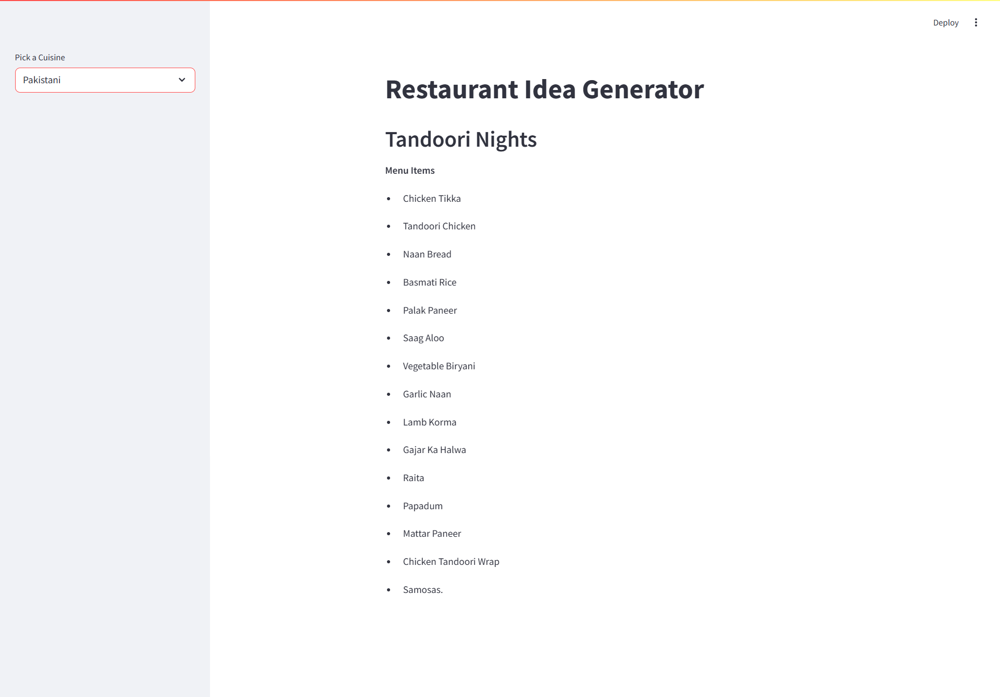
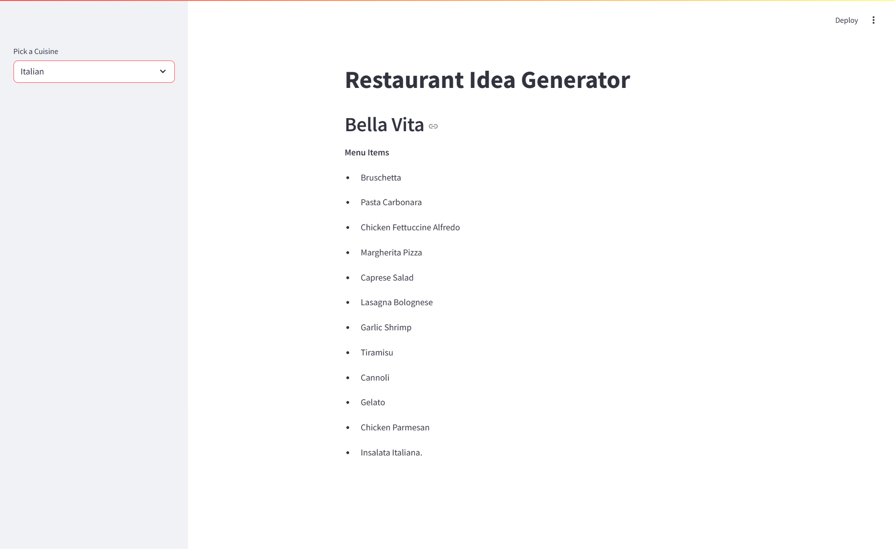

# 🍽️ Restaurant Idea Generator


A Generative AI-based application that dynamically generates creative restaurant names and menu items for various cuisines. It's an interactive web application that helps users create unique restaurant concepts by generating:
- Restaurant names
- Menu items

The application supports multiple cuisines including:
- Pakistani
- Italian
- Indian
- Mexican
- Arabic
- American

Perfect for Generative AI enthusiasts looking to begin their GEN-AI journey.

<p align="center">
  &nbsp;&nbsp;
  
</p>

## 🛠️ Tech Stack

- **Python**: Core programming language
- **Streamlit**: Web application framework for creating interactive UI
- **LangChain**: Framework for working with Large Language Models (LLMs)
- **LangChain-Groq**: Framework for enabling groq-based LLMs
- **Language Model**: Powers the text generation capabilities
- **Git**: Version control

## 🚀 How to Run

### Prerequisites

- Python 3.8 or higher
- pip (Python package installer)

### Installation

1. Clone the repository:
   ```bash
   git clone https://github.com/YAHYA-YOUNAS/Restaurant-Idea-Generator
   cd Restaurant-Idea-Generator
   ```

2. Create a virtual environment (recommended):
   ```bash
   python -m venv venv
   ```

3. Activate the virtual environment:
   - On Windows:
     ```bash
     venv\Scripts\activate
     ```
   - On macOS/Linux:
     ```bash
     source venv/bin/activate
     ```

4. Install the required packages:
   ```bash
   pip install -r requirements.txt
   ```

5. Set up your environment variables:
   - Create a `groq_keys` file in the project root
   - Add your API key if using external language models:
     ```
     GROQ_API_KEY="your_api_key_here"
     ```

### Running the Application

1. Start the Streamlit server:
   ```bash
   streamlit run app.py
   ```

2. Open your web browser and navigate to:
   ```
   http://localhost:8501
   ```

## 👥 Contributing

Contributions are welcome! Here's how you can contribute:

1. Fork the repository
2. Create a new branch (`git checkout -b feature/amazing-feature`)
3. Make your changes
4. Commit your changes (`git commit -m 'Add some amazing feature'`)
5. Push to the branch (`git push origin feature/amazing-feature`)
6. Open a Pull Request

### Guidelines for Contributions

- Follow the existing code style
- Add comments to your code where necessary
- Write descriptive commit messages
- Update documentation if you change functionality

## 🙏 Acknowledgements

- Based on concepts from [LangChain Crash Course](https://github.com/codebasics/langchain/tree/main/1_langchain_crash_course)
- Thanks to the Streamlit team for creating an amazing framework
- All contributors who have helped to improve this project

## 📄 License

This project is licensed under the MIT License.